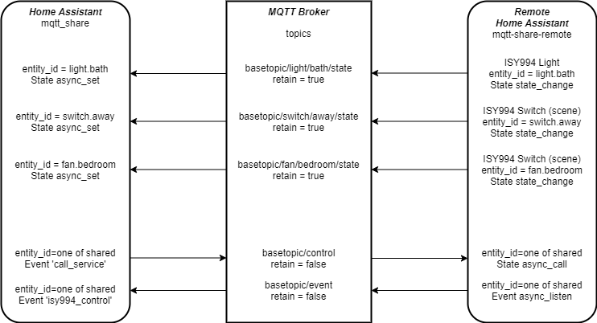

# MQTT Share Home Assistant Integration

[](https://github.com/custom-components/hacs)

In my Home Automation setup I use lots of SmartHome [Insteon](https://www.smarthome.com/insteon.html) devices controlled through an ISY-994i. This worked fine until I added another building to my property. Insteon devices support both RF and power line communication and neither worked consistently between the two buildings. I was also starting to add Z-Wave devices to my Home Automation system and it has the same problem between the two buildings. My solution was two instances of Home Assistant each with a Z-Stick for Z-Wave and an ISY-994i in each building. Now all my intra-building issues were solved but my attempts at using [MQTT Eventstream](https://www.home-assistant.io/components/mqtt_eventstream/) or [MQTT Statestream](https://www.home-assistant.io/components/mqtt_statestream/) to share data between multiple instances of Home Assistant left me wanting a solution that was a combination of both. With MQTT Eventstream events were shared (all mind you!) but entities were transient. If you restart Home Assistant all shared entities disappear until an event recreates the entity. With MQTT Statestream entity states are shared and retained but they are effectively read-only. What I really want is to share specified entities between two instances of Home Assistant where either instance can say turn a switch on and get state updates and receive events.

Enter my integrations: mqtt-share, [mqtt-share-remote](https://github.com/mikelawrence/mqtt-share-remote-hacs) and a MQTT Server. As shown in the diagram below the mqtt-share-remote is on right side and it is sharing three entities. Each entity has it's own state topic on the MQTT server and they are published with the retain flag. This prevents the shared entities from disappearing after a restart. If any of the entities are ISY994 devices then "isy994_control" events are published to the event topic. On the left side the mqtt-share integration is listening to all state topic using topic wildcards and isy994_controls event from the mqtt-share-remote. The mqtt-share also publishes control "call_service" events back to the mqtt-share-remote using the control topic. Any number of mqtt-share's can listen to a single mqtt-share-remote. It is also important that entity_ids be unique across all Home Assistant instances.



Although these components primarily support ISY-994i devices and Z-Wave devices they will work with many other components. Give them a try but keep in mind my use case is limited and there is plenty of room for unexpected cases.

## Installation

### HACS

If you have HACS installed on Home Assistant then just add ```https://github.com/mikelawrence/mqtt-share-remote-hacs``` to custom repositories under **HACS -> SETTINGS**. You can now go to **HACS -> INTEGRATIONS** and install mqtt-share.

### Manual

Copy the custom_components folder of this repository to your config folder and restart Home Assistant.

## Configuration

For the MQTT Share integration all you need to do is specify MQTT ```base_topic:``` and it will automatically pick all shared entities from the MQTT Share Remote.

```yaml
mqtt_share:
  base_topic: hass_share
```

## Issues

* None known.

## Debugging

To aid in debugging you can add the following to your configuration.yaml file. Be sure not to duplicate the ```logger:``` section.

```yaml
logger:
  default: warning
  logs:
    custom_components.mqtt_share: debug
```
